<html><head><meta content="text/html; charset=UTF-8" http-equiv="content-type"></head><body class="c14">

Mu Cyber CTF 2017 Write Ups

Mu Cyber ekibinin 25-26 Kas&#305;m 2017 tarihinde yapm&#305;&#351; oldu&#287;u Capture The Flag yar&#305;&#351;mas&#305;n&#305;n sorular&#305;n&#305;n &ccedil;&ouml;z&uuml;mleridir.

<h1 class="c13" id="h.t0229oowhby1">Flag Form</h1><h3 class="c2" id="h.rkj7zbvkort9">Flag - 10</h3>

Bu soru flag format&#305;n&#305; g&ouml;steriyordu.Yani cevap mucyb3r_{FLAG} olucakt&#305;.

<h1 class="c17" id="h.ncrml46603cg">Theory</h1><h3 class="c2" id="h.vm7dbat0s1k1">EXE - 100</h3>

http://bfy.tw/FB8q  flag: mucyb3r_{elf}

<h3 class="c2" id="h.89m5o8nusurq">GNU - 100</h3>

http://bfy.tw/FB95  flag: mucyb3r_{gdb}

<h3 class="c2" id="h.r81e5ag2a13v">Sub - 100</h3>

http://bfy.tw/FB9a  flag: mucyb3r_{26}

<h3 class="c2" id="h.teiuu8k4le2h">Wi-Fi - 100</h3>

http://bfy.tw/FBA5  flag: mucyb3r_{iwconfig}
<h3 class="c2" id="h.afwecv95kfz1">Arch - 150</h3>

https://wiki.archlinux.org/index.php/Arch-based_distributions

flag: mucyb3r_{blackarch}

<h1 class="c13" id="h.6rsxghgtfp8h">Crypto</h1><h3 class="c2" id="h.jv3tmblnxcrb">MD5 - 50</h3>

Verilen hash i MD5 ile decode etti&#287;imizde flage ula&#351;&#305;yoruz.

flag: mucyb3r_{h4ck3r}

<h3 class="c2" id="h.ooagg430x2xa">Tekrar Tekrar Dene - 100</h3>

Verilen hash i Base64 ile tekrar tekrar decode etti&#287;imizde flage ula&#351;&#305;yoruz.  flag: mucyb3r_{RECURSIVE}

<h3 class="c2" id="h.g6np2qjco9lb">NTLM - 100</h3>

Verilen hash i NTLM decrypt kullanarak decode etti&#287;imizde flage ula&#351;&#305;yoruz.  flag: mucyb3r_{yeni_basliyoruz}

<h3 class="c2" id="h.ylx2ebkse6i4">Zor De&#287;il - 150</h3>

Klasik bir &#351;ifreleme y&ouml;ntemi olan Vigen&eacute;re ile &#351;ifrelenmi&#351; veriyi verilen key sayesinde decrypt ederek flag e ula&#351;&#305;yoruz.  https://www.dcode.fr/vigenere-cipher  flag: mucyb3r_{blaise_de_vigenere}

<h3 class="c2" id="h.n18kazgiosi5">ZOR - 200</h3>

Bu soruda erilen de&#287;eri XOR ile decrypt etmemiz gerekiyordu. Bunun i&ccedil;in http://strelitzia.net/wasXORdecoder/wasXORdecoder.html &#305; kulland&#305;k.  flag: mucyb3r_{hosgeldiniz}

<h1 class="c13" id="h.n7nyd8bijdyk">Web - Network</h1><h3 class="c2" id="h.5g5bzppdeeg3">Troll Sel&ccedil;uk - 100</h3>

100 Puanl&#305;k Troll Sel&ccedil;uk sorusu. &Ouml;ncelikle sorumuzu a&ccedil;t&#305;&#287;&#305;m&#305;zda hi&ccedil;bir a&ccedil;&#305;klama olmaks&#305;z&#305;n bir drive linki veriliyordu. Drive linkinden hintce.tar.xz isimli dosyay&#305; bilgisayar&#305;m&#305;za indiriyoruz. &#304;&ccedil;erisinde sadece hintce.html dosyas&#305; var. Html dosyas&#305;n&#305; &ccedil;al&#305;&#351;t&#305;rd&#305;&#287;&#305;m&#305;zda bizi &ouml;ncelikli olarak bo&#351; bir sayfadan youtube linkine y&ouml;nlendiriyor.

Tabiki can al&#305;c&#305; nokta buras&#305;. Bunu farketmemiz gerekiyor. Sayfa y&uuml;klendi&#287;inde kar&#351;&#305;m&#305;za e&#287;lenceli bir video &ccedil;&#305;k&#305;yor.

Videoyu keyifle izliyoruz ve bitiyor :) Burda flag yok. Sonra yapmam&#305;z gereken &#351;ey hintce.html dosyas&#305;n&#305;n kaynak kodlar&#305;na bakmal&#305;y&#305;z. Sayfan&#305;n kaynak kodlar&#305;na bakabilmek i&ccedil;in html dosyas&#305;n&#305; bir text edit&ouml;r yard&#305;m&#305;yla a&ccedil;&#305;yoruz. Kar&#351;&#305;m&#305;za 14 sat&#305;r k&#305;sa bi kod blo&#287;u &ccedil;&#305;k&#305;yor ve dikkatlice bakt&#305;&#287;&#305;m&#305;zda burda div etiketi i&ccedil;erisinde flag&#39;in tan&#305;ml&#305; oldu&#287;unu g&ouml;r&uuml;yoruz.

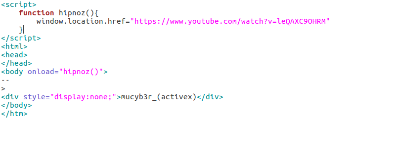  flag : mucyb3r_(activex)

<h3 class="c2" id="h.85b2evrgaobq">Shrek - 200</h3>

200 Puanl&#305;k Shrek sorusu. &Ouml;ncelikle sorumuzu a&ccedil;t&#305;&#287;&#305;m&#305;zda hi&ccedil;bir a&ccedil;&#305;klama olmaks&#305;z&#305;n bir drive linki veriliyordu. Drive linkinden troll.rar isimli dosyay&#305; indiriyoruz. &#304;&ccedil;eri&#287;ine bak&#305;yoruz 2 klas&ouml;r ve 2 dosya var.

Bu dosyalara g&ouml;z gezdiriyoruz ve Hahaha!!!.html dosyas&#305;n&#305; a&ccedil;&#305;yoruz i&ccedil;eri&#287;inde &ccedil;&#305;ld&#305;rmaya haz&#305;r m&#305;s&#305;n diye bir mesaj var

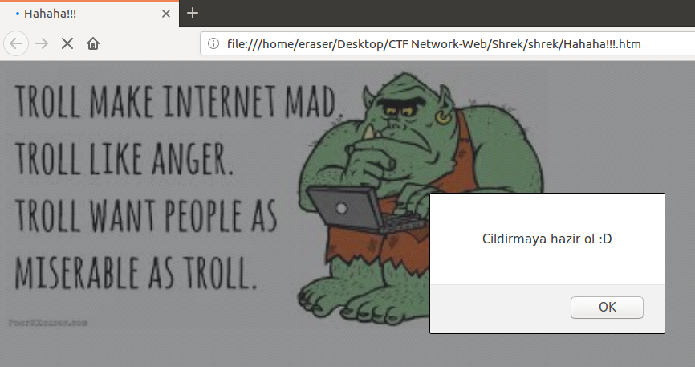

OK butonuna bast&#305;ktan sonra ekrandaki sayfa de&#287;i&#351;iyor. Dosyalara g&ouml;z gezdiriyoruz. Json ile yaz&#305;lm&#305;&#351; dosyalar g&ouml;r&uuml;yoruz. Hook.js dosyas&#305;n&#305;n kaynak kodunu inceledi&#287;imizde &#351;ifreli kod blo&#287;u g&ouml;r&uuml;n&uuml;yor. Fonksiyon i&ccedil;erisindeki encode edilmi&#351; kodlar&#305; kopyalay&#305;p &quot;https://www.unphp.net&quot; web adresi veya herhangi Php Decoder sayfas&#305;nda decode etti&#287;imizde kar&#351;&#305;m&#305;za flag is here diye tan&#305;ml&#305; flag&#39;imiz &ccedil;&#305;k&#305;yor.

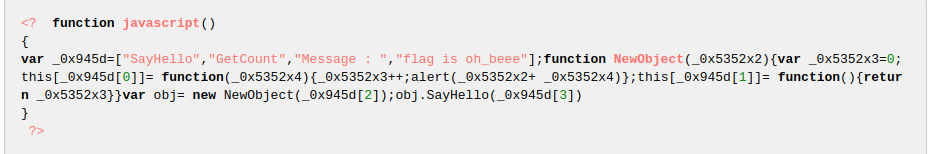  flag: mucyb3r_{oh_beee}

<h3 class="c2" id="h.std53t97scrg">Uptime - 250</h3>

Soruda SSID si Meryem olan kullan&#305;c&#305;n&#305;n Uptime suresini bulabilir misin? diyordu. Bu sorunun benzeri SDUCTF&#39;de kullan&#305;ld&#305;. Al&#305;nt&#305;d&#305;r Bize bir adet .pcap(analiz edilmi&#351; a&#287; dosyas&#305;) verilmi&#351;. Ve uptime s&uuml;resini bulmam&#305;z isteniyor. Komut sat&#305;r&#305;ndan airodump-ng arac&#305;yla uptime s&uuml;resini bulabiliyoruz. airodump arac&#305;n&#305; kullanabilmemiz i&ccedil;in aircrack-ng&#39;nin y&uuml;kl&uuml; olmas&#305; gerekiyor alt text Bilgisayar&#305;n&#305;zda aircrack-ng yok ise &quot;sudo apt-get install aircrack-ng&quot; komutu ile ekliyoruz. Komut sat&#305;r&#305;na airodump-ng -r (dosya konumu) --uptime (-r parametresi dosyay&#305; belirtmek i&ccedil;in kullan&#305;l&#305;yor, --uptime parametresi ise uptime s&uuml;resini kolon olarak eklemeyi sa&#287;lar) Bu komutu verdi&#287;imizde meryem isimli kullan&#305;c&#305;n uptime s&uuml;resinin &quot;00:10:54&quot; oldu&#287;unu g&ouml;r&uuml;yoruz.  flag: mucyb3r_{00:10:54}

<h3 class="c2" id="h.tv4tpkw2h6tq">Handshake - 300</h3>

300 Puanl&#305;k Handshake Sorusu; Galatasarayl&#305; Emel&rsquo;in kablosuz a&#287;&#305;n&#305; ele ge&ccedil;irmek isteyen sald&#305;rgan, bir handshake yakalad&#305;. Parolay&#305; bulmas&#305;na yard&#305;m eder misiniz? NOT: Parola 8 karakterlidir. Bize verilen ipu&ccedil;lar&#305;: Galatasaray,Emel,8 Karakter Drive dosyas&#305;ndan indirdi&#287;imiz .cap(yakalanm&#305;&#351; paket dosyas&#305;)&#39;n&#305; analiz etmek i&ccedil;in kullanacak oldu&#287;umuz 2 ara&ccedil; var 1)aircrack-ng 2)crunch. Bu 2 ara&ccedil; sayesinde parolay&#305; elde edebiliriz. Crunch:verilen karakter uzunlu&#287;unda ve belirtilen kriterlere g&ouml;re &#351;ifreler &uuml;retiyor ve bu &#351;ifreleri belirtti&#287;imiz dosya &uuml;zerinde brute-force tekni&#287;ini kullanarak deniyor. kullan&#305;m &#351;ekli i&ccedil;in &quot;crunch (min-max karakter say&#305;s&#305;) (ipu&ccedil;lar&#305;) -r (output.file)&quot; -r parametresi dosyaya kaydetmek i&ccedil;in belirtiliyor. &Uuml;retmi&#351; oldu&#287;umuz &#351;ifreleri bir txt dosyas&#305;na kaydettik, bu i&#351;lem biraz zaman alabiliyor t&uuml;m karakterlerin kombinasyonlar&#305;n&#305; deniyor. Ard&#305;ndan aircrack-ng komutuyla kaydetmi&#351; oldu&#287;umuz &#351;ifre dosyas&#305;n&#305; ve .cap dosyas&#305;n&#305; brute-force i&#351;lemine tabii tutuyoruz. K&#305;sa s&uuml;re sonra &#351;ifreyi buluyoruz. 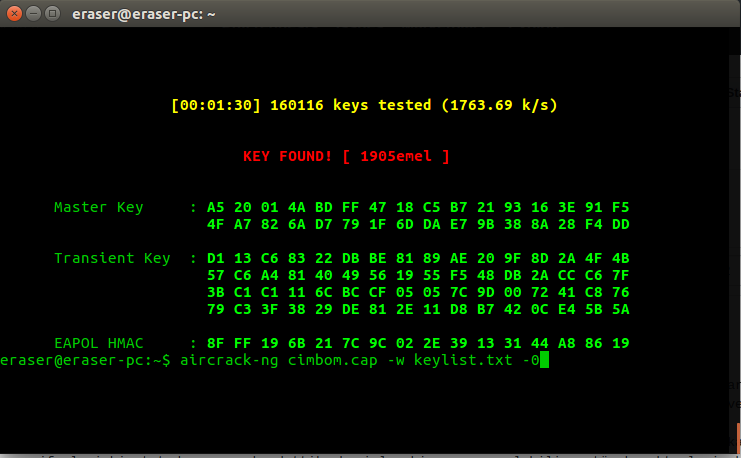  flag: mucyb3r_{1905emel}

<h3 class="c2" id="h.ubypo6na6av">Mr.Robot - 400</h3>

400 Puanl&#305;k MrRobot sorusu. Kar&#351;&#305;m&#305;zda sadece .pcapng format&#305;nda bir dosya var. &Ouml;ncelikli olarak bu dosyay&#305; wireshark ile pcap dosya format&#305;na &ccedil;eviriyoruz. Sonras&#305;nda komut sat&#305;r&#305;na &quot;tcpflow -d2 -r mrrobot.pcap&quot; (-r dosya belirtme, -d hata ay&#305;klama &ccedil;&#305;kt&#305;lar&#305;) yazd&#305;&#287;&#305;m&#305;zda ekrana gelen &ccedil;&#305;kt&#305;; tcpflow: retrying_open ::open(fn=004.005.006.007.12345-008.009.010.011.02355,oflag=xc2,mask:x1b6)=5 tcpflow: Open FDs at end of processing: 1 tcpflow: demux.max_open_flows: 1 tcpflow: Flow map size at end of processing: 1 tcpflow: Flows seen: 1 tcpflow: Total flows processed: 1 tcpflow: Total packets processed: 1821  B&ouml;yle bir geri d&ouml;n&uuml;t vermekte.004.005.006.007.12345-008.009.010.011.02355 isimli dosyay&#305; $ file 004.005.006.007.12345-008.009.010.011.02355 yazd&#305;&#287;&#305;m&#305;zda ise 004.005.006.007.12345-008.009.010.011.02355: JPEG image data, JFIF standard 1.01, resolution (DPI), density 72x72, segment length 16, progressive, precision 8, 564x572, frames 3 d&ouml;n&uuml;t&uuml;n&uuml; vermekte.Yani pcap bir resim dosyas&#305;.Resim dosyas&#305; a&ccedil;&#305;ld&#305;&#287;&#305;nda bayra&#287;&#305;m&#305;z&#305; resmin &uuml;zerinde g&ouml;rmekteyiz.  flag: mucyb3r_{unshattered.jpg}

<h1 class="c13" id="h.2a8zfj784pyq">Stegano</h1><h3 class="c2" id="h.5pirbo5yajka">Hack &#304;&#351;lemi Ba&#351;lat&#305;lm&#305;&#351;t&#305;r - 100</h3>

Soruyu a&ccedil;t&#305;&#287;&#305;m&#305;zda resimde saklanm&#305;&#351; bir mesaj vard&#305;. Steganography ile saklanm&#305;&#351; mesaj&#305; a&ccedil;&#305;&#287;a &ccedil;&#305;kartabiliriz. Bunun i&ccedil;in http://incoherency.co.uk/image-steganography/#unhide arac&#305;n&#305; kullanarak cevab&#305; mucyb3r_(Turkey) olarak buluyoruz.  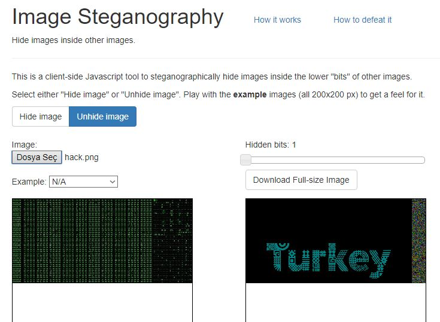
<h3 class="c2" id="h.k4ygef5iqbye">Kul Hakk&#305; - 200</h3>

Bu soruda &quot;strings&quot; komutunu kullanarak flag e ula&#351;&#305;yoruz.

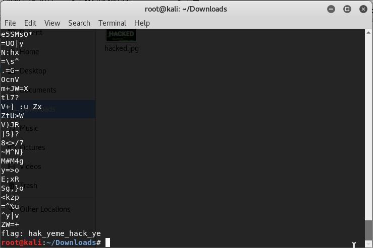

flag: mucyb3r_{hak_yeme_hack_ye} 

<h3 class="c2" id="h.3s5veyy45fba">ScreenShot - 250</h3>

mucyb3rctf i Snapchat adl&#305; sosyal medya uygulamas&#305;nda ekleyip son att&#305;&#287;&#305; story e bak&#305;nca kar&#351;&#305;m&#305;za bir karekod &ccedil;&#305;k&#305;yor.  Bu karekodu herhangi bir karekod okuyucu ile okutunca flag e ula&#351;&#305;yoruz. 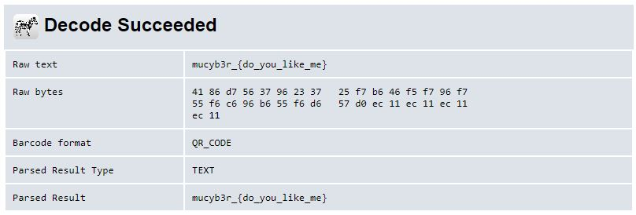

flag: mucyb3r_{do_you_like_me}

<h3 class="c2 c9" id="h.cmmr7f91wm3s"></h3>
<h3 class="c2 c9" id="h.qyhx5ztn3ehs"></h3><h3 class="c2" id="h.p196fym8ss20">Who is this guy? - 300</h3>

Verilen foto&#287;raftaki dosyan&#305;n ad&#305; blockchain speech ile alakal&#305;yd&#305;.  Google G&ouml;rseller&#39; de blockchain speech diye aratt&#305;&#287;&#305;m&#305;zda ilk foto&#287;raftaki adam&#305;n bizim adam&#305;m&#305;zla ayn&#305; adam oldu&#287;unu g&ouml;r&uuml;yoruz.  Bu adam&#305;n ad&#305; ise Vitalik Buterin.

flag: mucyb3r_{vitalik_buterin}

<h3 class="c2" id="h.8e28yfgadwo4">24 Kas&#305;m - 400</h3>

Bu soruyu &ccedil;&ouml;zmek i&ccedil;in mimkatz arac&#305;ndan faydalanaca&#287;&#305;z. Mimikatz i indirdikten sonra verilen dosyay&#305; mimikatz&#39;in klas&ouml;r&uuml;ne kopyal&#305;yor ve mimikatz i &ccedil;al&#305;&#351;t&#305;r&#305;yoruz. S&#305;ras&#305;yla komutlar&#305; giriyoruz: 

&quot;privilege::debug&quot;

&quot;sekurlsa::minidump lsass.DMP&quot; 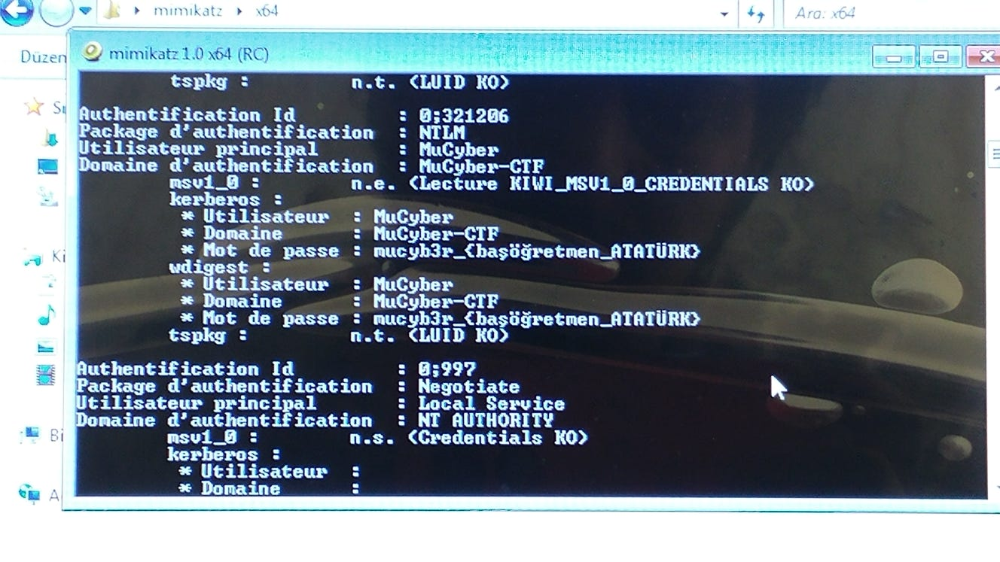  flag: mucyb3r_{ba&#351;&ouml;&#287;retmen_ATAT&Uuml;RK}

<h1 class="c13" id="h.s2uh9t2ntf8r">Forensic</h1><h3 class="c2" id="h.lk59mifxf6nf">Log - 100</h3>

Dosyam&#305;z&#305; indirdikten sonra note pad ile a&ccedil;&#305;yoruz. CTRL+F yaparak &quot;mucyb3r&quot; &#351;eklinde arama yap&#305;yoruz flag kar&#351;&#305;m&#305;za &ccedil;&#305;k&#305;yor.

  flag: mucyb3r_{learn_searching}

<h3 class="c2" id="h.npv59ow5th9y">Hacker Okan - 150</h3>

jpg dosyam&#305;z&#305; indirdikten sonra Hacker Okan&#39;a sa&#287; t&#305;kl&#305;y&#305;p &ouml;zelliklerine giriyoruz.

 A&ccedil;&#305;lan pencerede ayr&#305;nt&#305;lara girince kar&#351;&#305;m&#305;za base64 ile &#351;ifrelenmi&#351; bir hash &ccedil;&#305;k&#305;yor.

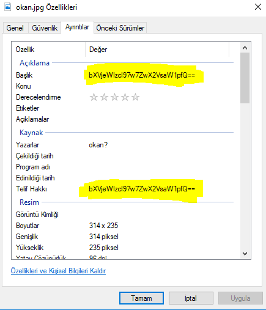 Bunu base64 ile decode edince kar&#351;&#305;m&#305;za flag &ccedil;&#305;k&#305;yor.  flag: mucyb3r_{&ouml;p_elimi}

<h3 class="c2" id="h.8rwqqvexgy62">Digital World - 200</h3>

Sorumuzda verdi&#287;iz linke girince kar&#351;&#305;m&#305;za iyibakiyi.txt adl&#305; bir dosya &ccedil;&#305;k&#305;yor. Bu dosyay&#305; indirip notepad++ ile a&ccedil;&#305;yoruz. CTRL+F yap&#305;p kar&#351;&#305;m&#305;za &ccedil;&#305;kan penceredende&#287;i&#351;tir k&#305;sm&#305;na giriyoruz.

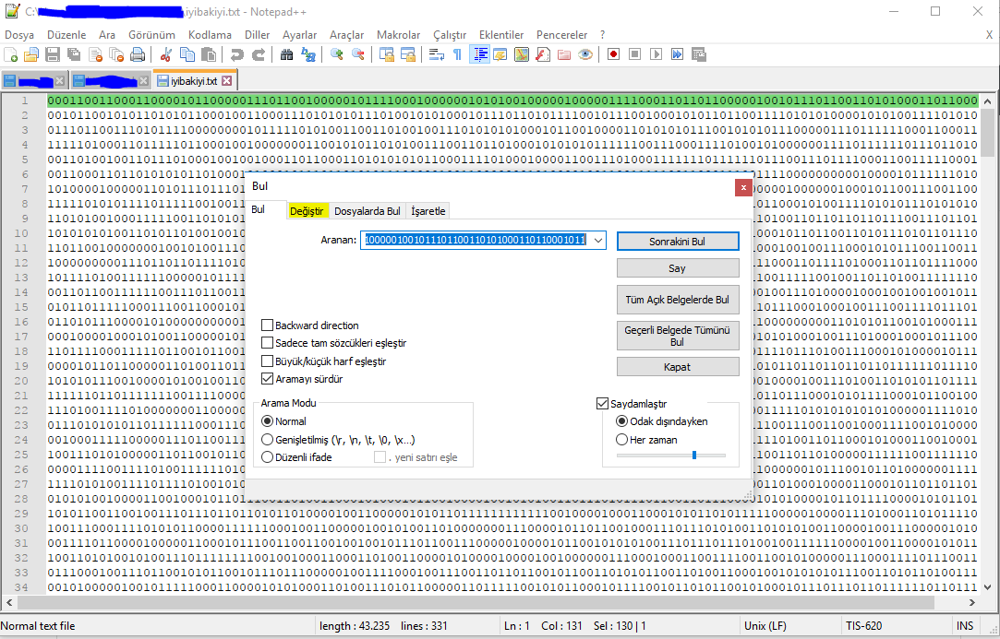 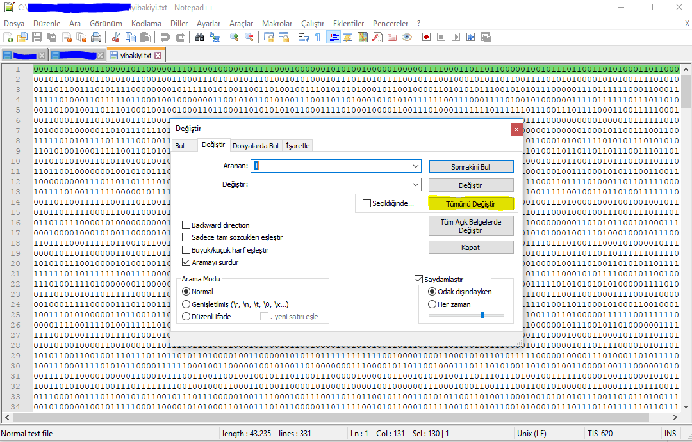 Buradan aranan k&#305;sm&#305;na 1 yaz&#305;p de&#287;i&#351;tir k&#305;sm&#305;n&#305; bo&#351; b&#305;rakarak t&uuml;m&uuml;n&uuml; de&#287;i&#351;tir diyoruz. Ard&#305;ndan ayn&#305; i&#351;lemi 1 yerine 0 yaz&#305;p tekrar ediyoruz. Bu i&#351;lemleri yapt&#305;ktan sonra dosyam&#305;zda sadece flag&#39;&#305;m&#305;z kal&#305;yor.

  flag: mucyb3r_{k&ouml;roldum}

<h3 class="c2" id="h.d9ull53cn3cw">Git - 200</h3>

Sorumuzda verilen linke giriyoruz. 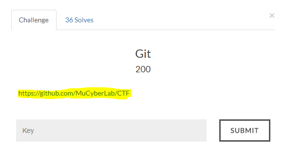 Kar&#351;&#305;m&#305;za &ccedil;&#305;kan github reposunda commitlere bak&#305;yoruz. Yeterince eski commitlere gidince delete flag ad&#305;nda bir commit ile kar&#351;&#305;la&#351;&#305;yoruz. Bu commite girince flag kar&#351;&#305;m&#305;za &ccedil;&#305;k&#305;yor. 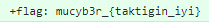

 flag: mucyb3r_{taktigin_iyi}

<h3 class="c2" id="h.jmk6le5ns9li">Use Calc - 500</h3>

Verilen linke girince bir ses dosyas&#305; ile kar&#351;&#305;la&#351;&#305;yoruz. Bu ses dosyas&#305;n&#305;n i&ccedil;inde ise arama esnas&#305;nda bas&#305;lan tu&#351;lar&#305;n sesleri yer al&#305;yor. Bu ses dosyas&#305;n&#305; http://dialabc.com/sound/detect/ adresine y&uuml;kl&uuml;yoruz.

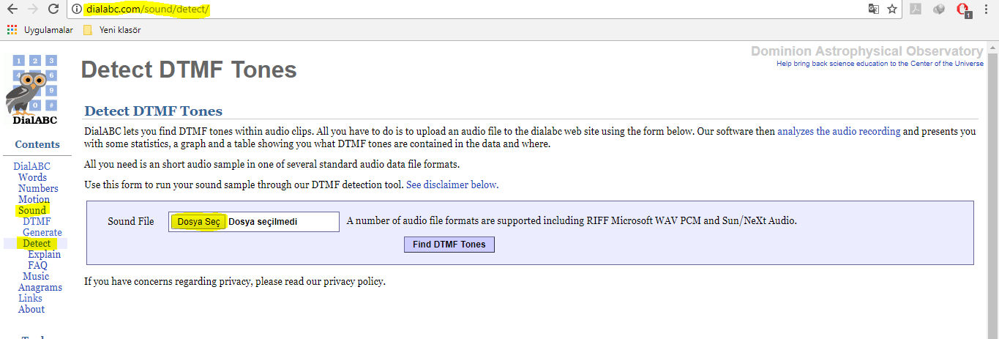 Kar&#351;&#305;m&#305;za 317537 &#351;eklinde bir say&#305; &ccedil;&#305;k&#305;yor. 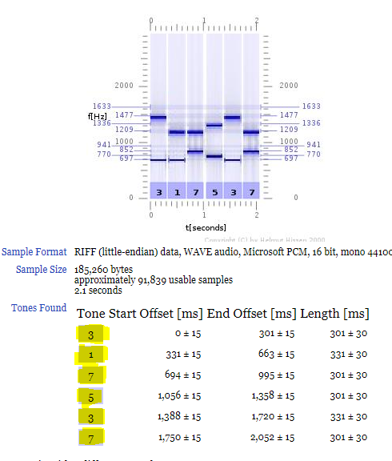 Bu say&#305;y&#305; hesap makine yaz&#305;p ters &ccedil;evirdi&#287;imizde flag kar&#351;&#305;m&#305;za &ccedil;&#305;k&#305;yor.   flag: mucyb3r_{leslie}
<h2 class="c16" id="h.e9hlra504min"></h2>
<h2 class="c16" id="h.sxjluuo7qxlq"></h2>
<h1 class="c13" id="h.26bb8mk7z6o0">Mixed</h1><h3 class="c2" id="h.nsfws692n5yh">Dosya Analizi - 500</h3>

Sorumuzda verilen linki indirince siber.png ad&#305;nda bir dosya kar&#351;&#305;m&#305;ca &ccedil;&#305;k&#305;yor. Bu dosyay&#305; linux komut sat&#305;r&#305;nda &quot;strings&quot; komutu ile a&ccedil;&#305;yoruz.  Bu i&#351;lemden sonra kar&#351;&#305;m&#305;za bir tak&#305;m binary kodlar&#305; &ccedil;&#305;k&#305;yor. 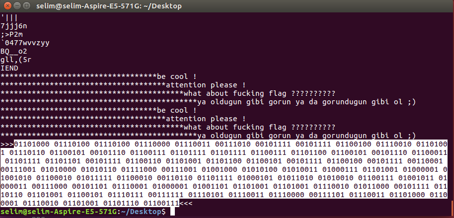 Bu kodlar&#305; binary converter ile karakterlere &ccedil;evirdi&#287;imizde kar&#351;&#305;m&#305;za ba&#351;ka bir link &ccedil;&#305;k&#305;yor. Bu linkte ise bak_da_g&ouml;r.png ad&#305;nda bir karekod ile kar&#351;&#305;la&#351;&#305;yoruz. Bu karekodu indirip tekrar &quot;strings&quot; komutu ile a&ccedil;&#305;nca kar&#351;&#305;m&#305;za ba&#351;ka bir link daha &ccedil;&#305;k&#305;yor :)  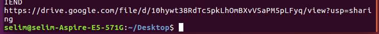 Bu linkten ise fifi.tar ad&#305;nda bir dosya ile kar&#351;&#305;la&#351;&#305;yoruz. Tar dosyas&#305;n&#305;n i&ccedil;indekileri &ccedil;&#305;kard&#305;&#287;&#305;m&#305;zda 13.pdf, g&ouml;rmek-&ouml;nemli.png, ordam&#305;s&#305;n-de&#287;ilmisin.pcap ad&#305;nda 3 dosya bizi kar&#351;&#305;l&#305;yor. 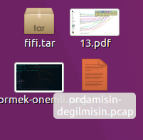 Ordam&#305;s&#305;n-de&#287;ilmisin.pcap dosyas&#305;n&#305; wireshark ile a&ccedil;&#305;yoruz. 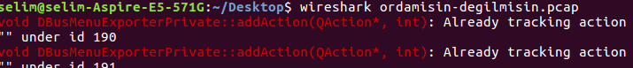 Bu sefer kar&#351;&#305;m&#305;za &ccedil;&#305;kan ekranda, ICMP paketlerinin i&ccedil;inde ba&#351;ka bir tak&#305;m binary kodlar&#305; ile kar&#351;&#305;la&#351;&#305;yoruz.  bunlar&#305; da &ccedil;evirince flag&#305;m&#305;z &ccedil;&#305;k&#305;yor. 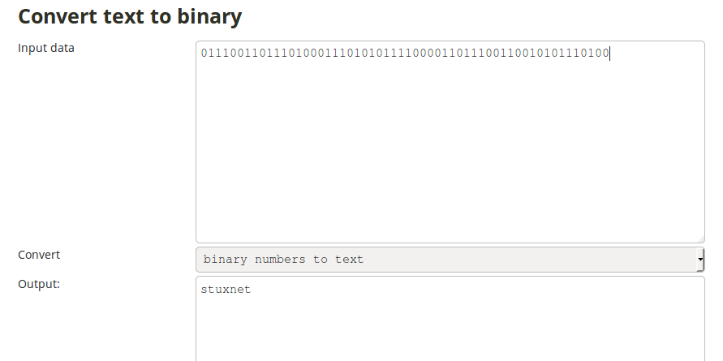  flag: mucyb3r_{stuxnet}

<h3 class="c2" id="h.hinhmck9loe9">C Program - 500</h3>

Bu sorumuzda verilen <a class="c0" href="https://www.google.com/url?q=https://github.com/MuCyberLab/CTF/blob/master/Mixed/files/c.cpp&amp;sa=D&amp;ust=1513280652604000&amp;usg=AFQjCNFkOiRRIdB5IXNRbWeluwQLsf507A">c.cpp</a>&nbsp;adl&#305; dosyam&#305;z her ne kadar C dili ile yaz&#305;m&#305;&#351; gibi g&ouml;r&uuml;nse de bu dosyam&#305;z&#305;n yaz&#305;ld&#305;&#287;&#305; dil White Space dilidir. <a class="c0" href="https://www.google.com/url?q=https://tio.run/%23whitespace&amp;sa=D&amp;ust=1513280652605000&amp;usg=AFQjCNH3x2LS5tjeRtKV3NJezoeZuayNWg">Bu linkten</a>&nbsp;verilen kodu yap&#305;&#351;t&#305;rd&#305;&#287;&#305;m&#305;zda flag de&#287;eri gayet ne bir &#351;ekilde g&ouml;r&uuml;lebiliyordu.   flag: mucyb3r_{WpUAItsadmhak}

<h1 class="c13" id="h.chu924qfa5n9">Joy</h1><h3 class="c2" id="h.29gtu0uso56z">Tweety - 300</h3>

Bu sorumuzda flag de&#287;erini almak i&ccedil;in Twitter&#39;da https://twitter.com/mucyberlab sayfam&#305;z&#305; takip edip #mucyberCTF hashtag alt&#305;nda tweet atman&#305;z gerekiyordu. Ard&#305;ndan Sayfa y&ouml;neticilerimiz size bir flag de&#287;eri verdi.

<h3 class="c2" id="h.jeeo9c7b32dt">Algebra - 300</h3>

Bu sorumuzda ilk &ouml;nce denklemlerdeki x de&#287;erlerini tek tek bulman&#305;z gerekiyordu:  2x-7=211 x=109 x-8=109 x=117 x+2=101 x=099 x+10=131 x=121 -x+8=-90 x=098 -2x+5=-97 x=051 2x-1=227 x=114 -x+10=-85 x=095 x-9=114 x=123 2x-5=201 x=103 -3x+9=-342 x=117 -x+1=-115 x=116 3x+2=155 x=051 -2x+3=-217 x=110 -3x-1=-286 x=095 -x-3=-112 x=109 2x+9=105 x=048 x-4=110 x=114 -3x+10=-299 x=103 4x+1=205 x=051 x-11=99 x=110 -x+3x=250 x=125 Buldu&#287;umuz say&#305;lar ASCII format&#305;nda oldu&#287;undan herhangi bir online ASCII Decoder sayfas&#305;nda decode etti&#287;imizde flag de&#287;eri gayet a&ccedil;&#305;k bir &#351;ekilde g&ouml;r&uuml;l&uuml;yordu. 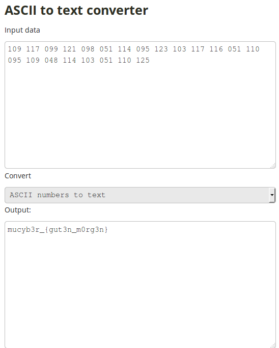  flag: mucyb3r_{gut3n_m0rg3n}

<h3 class="c2" id="h.83mpqgn26pl9">998 mi? - 400</h3>

Bu sorumuzda kar&#351;&#305;m&#305;za Mu-Cyber.exe adl&#305; bir dosya geliyordu. Dosyay&#305; a&ccedil;t&#305;&#287;&#305;m&#305;zda fareyi &uuml;zerine getirdi&#287;imizde kayan bir buton vard&#305;. Butona t&#305;klayabilmek i&ccedil;in TAB+ENTER tu&#351;lar&#305;na 998 kez basmam&#305;z gerekiyordu. K&#305;sa bir yol olarak basit bir Autoit scripti yazarak k&#305;sa s&uuml;rede flag de&#287;erine ula&#351;mam&#305;z m&uuml;mk&uuml;nd&uuml;.

 flag: mucyb3r_{auto_it_babe}

<h3 class="c2" id="h.b4xmx5sv456w">Ne Diyo Bu? - 500</h3>

Bu sorumuzda Mors Alfabesi ile kodlanm&#305;&#351; bir ses dosyas&#305; vard&#305;. Flag de&#287;erine ula&#351;abilmek i&ccedil;in dosyay&#305; herhangi bir online Morse Decoder sitesinden decode edip vigenere kodumuz i&ccedil;in gerekli olan key de&#287;erini buluyorduk. Ard&#305;ndan dosyay&#305; Sonic Visualiser adl&#305; ses program&#305; ile a&ccedil;&#305;p &ouml;zellikleri Spectogram sekmesinden &#351;ekildeki gibi ayarlad&#305;&#287;&#305;m&#305;zda kar&#351;&#305;m&#305;za bir sat&#305;r yaz&#305; geliyordu. Ard&#305;ndan bu sat&#305;rda yazanlar&#305; online bir Vigenere Cipher yard&#305;m&#305;yla key de&#287;erimizi girerek flag de&#287;erine ula&#351;&#305;yoruz.   flag: mucyb3r_{sesim_geliyomu}

<h3 class="c2" id="h.jpvrt6a3vuem">Ni&#351;asta - 1000</h3>

Bu sorumuz herhalde b&uuml;t&uuml;n yar&#305;&#351;mac&#305;lar&#305;m&#305;z&#305; beynini yakm&#305;&#351;t&#305;r :) Soruda sonradan <a class="c0" href="https://www.google.com/url?q=https://twitter.com/MuCyberLab&amp;sa=D&amp;ust=1513280652607000&amp;usg=AFQjCNESNxXqFw6q9uNyEV7Q4uup0fvBVQ">Twitter Adresimizde</a>&nbsp;verilen ipucundan yola &ccedil;&#305;karak Google arama motoruna &quot;2011 Erzurum&quot; yazd&#305;&#287;&#305;m&#305;zda ilk &ccedil;&#305;kan arama sonucunda k&#305;&#351; olimpiyatlar&#305;n&#305; g&ouml;r&uuml;yoruz. Ard&#305;ndan <a class="c0" href="https://www.google.com/url?q=https://tr.vikipedi.pw/wiki/2011_D%25C3%25BCnya_%25C3%259Cniversiteler_K%25C4%25B1%25C5%259F_Oyunlar%25C4%25B1&amp;sa=D&amp;ust=1513280652608000&amp;usg=AFQjCNEowz4WXDLeNTrrjvj3MCEz1P7lfw">bu linke</a>&nbsp;t&#305;klad&#305;&#287;&#305;m&#305;zda alt k&#305;s&#305;mda D&uuml;nya &Uuml;niversite Oyunlar&#305; k&#305;sm&#305;nda yaz olimpiyatlar&#305;n&#305;n yap&#305;ld&#305;&#287;&#305; y&#305;llar yaz&#305;yordu.

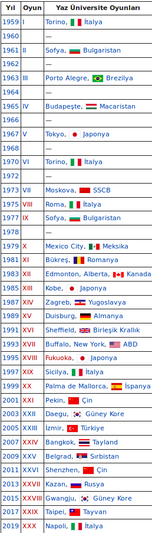

Y&#305;llar&#305; verilen s&#305;rayla yazd&#305;&#287;&#305;m&#305;zda ni&#351;astan&#305;n hidroliz edilmesiyle olu&#351;an karbonhidrat grubunun ismi olan DEKSTR&#304;N flag de&#287;eri geliyordu.   flag: mucyb3r_{dekstrin}
</body></html>
-----

Want to see something else added? <a href="https://github.com/poole/poole/issues/new">Open an issue.</a>
